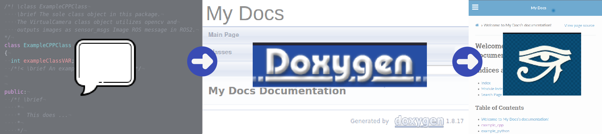
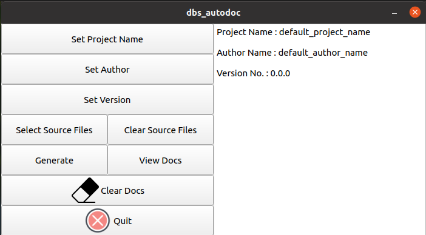

[](https://github.com/cardboardcode/dbs_autodoc/actions/workflows/ci.yml) [](https://codecov.io/gh/cardboardcode/dbs_autodoc) [](https://opensource.org/licenses/Apache-2.0) 

## **What is This?**

### A generic tool for <ins>generating documentation</ins> from either/both **Python** and **C++** source codes using <ins>Doxygen</ins>.

## **Dependencies**
1. [Python3](https://www.python.org/downloads/)
2. [Breathe](https://pypi.org/project/breathe/)
3. [Doxygen](https://www.doxygen.nl/index.html)
4. [sphinx-rtd-theme](https://sphinx-rtd-theme.readthedocs.io/en/stable/installing.html)
5. [sphinx-sitemap](https://pypi.org/project/sphinx-sitemap/)
6. [Pyside2](https://pypi.org/project/PySide2/)

#### Install
Do this if you do not intend to use **Docker**.

```bash
sudo apt-get install -y doxygen
pip3 install --user sphinx-rtd-theme breathe sphinx-sitemap
pip3 install --user pyside2
```

## **Run**

1. Follow either one of the Step 1s below.
**Docker** - If you don't want to worry about installing dependencies.
**Local** - If you have installed the dependencies as shown above.

### [**Docker**]
Run command to start the GUI using Docker.

```bash
bash run_docker.bash <File Directory to the codebase you wish to document>
# bash run_docker.bash ./test
python run_app.py
```
### [**Local**]
Run command to start the GUI using your local environment.

```bash
python3 run_app.py
```

A window, labelled **dbs_autodoc**, will appear as such.



2. Click on **Set Project Name**.

> From here, you can enter any name you wish to give for your package documentation.

3. Click on **Set Author**.

> From here, you can enter the names of the authors for your packag documentation.

4. Click on **Set Version**.

> From here, you can enter the version of the package documentation.

It is recommended to adhere your package versioning scheme to that of Semantic Versioning. Please see [this link](https://semver.org/) for further details.

5. Click on **Generate**.

This button will do the following:

```
1. Create Doxygen.in file
2. Modify Doxygen.in file to include all modifications based on earlier configurations set.
3. Generate Doxygen documentation in preliminary xml format.
4. Create docs_sphinx template directory.
5. Modify docs_sphinx conf.py based on earlier configurations set.
6. Generate final Sphinx documentation in final html format.
7. Copy to final html files to root directory folder, output_docs.
```

6. Click on **View Docs**.

> This feature assumes you have firefox. If you do not, please run the the following command to use the browser of your choice.

> <browser> output_docs/index.html


## **Documenting Code with Doxygen**

This section provides examples on how to document your Python and C++ codes.

### **Python**

```python
'''
  ... Descriptive message ...
'''
```
An example is provided under `test/example_python.py`

### **C++**

Place the following line in front of major code blocks in C++.
```cpp
/*!< \brief ... Descriptive message ... */
```
An example is provided under `test/example_cpp.hpp`

For further details, please refer to [this link](https://www.doxygen.nl/manual/docblocks.html

## **Testing**
:warning:
This section allows you to test whether the **Graphical User Interface** (GUI) works on your local workstation. Due to limitation in how **Continuous Integration** (CI) allows testing to be done for a GUI-based python program, the **unit testing for the GUI** in dbs_autodoc is **not included**.
```bash
pip install --user pytest pytest-qt pytest-cov
python -m pytest --cov-report term-missing --cov=dbsautodoc_library.rosdocgui  test_pytest/test_run_gui.py
```

## **Acknowledgement**
Credits to **[ROS-Industrial Consortium Asia Pacific](https://rosindustrial.org/ric-apac)** for providing the opportunity and industrial resources used in developing and testing this project.
